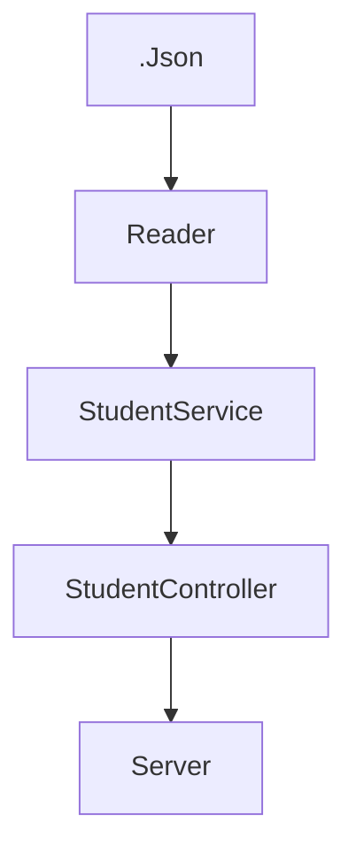
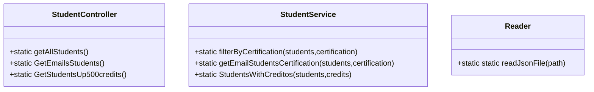

# CodeChallenge1-Thinking-API

## Dependencias utilizadas:

#### Node - Proyecto
Proyecto en Node v16.13.2

Creación del proyecto con el comando  (generando el archivo package.json):

- npm init 

#### Git - Gestión de Versiones
El proyecto cuenta con gestión de versiones con Git. Creando un repositorio local y un reposotorio Remoto en GitHub.

Cada cambio en el proyecto se puede revisar en los [commits](https://github.com/ArmandoRuiz13/CodeChallenge1-Thinking-API/commits/master).

Nota: En el proyecto tenemos .gitignore para no versionar el folder node_models.

#### Jest - Pruebas Unitarias
El proyecto tiene instalado Jest para la realización de pruebas Unitarias.

Para su instalacion y configuración, se corrieron los siguientes comandos:

- pm install jest@26.0.0 --save

Configuración en package.json para agregar el script para correr jest:

- "test": "node --experimental-vm-modules ./node_modules/jest/bin/jest"

#### Express - API
El proyeto tiene istalado express para crear la API solicitada.

Comando para instalar express en el proyecto:

- npm install express --save 

Configuración en package.json para agregar el script para correr el API:

- "server": "node ./lib/server.js"

#### Linter
Permite revisar el cógigo para darle estilo mediante reglas automatizadas.

Comando para su instalación:

- npm install eslint --save-dev

Comando para la configuracion, general el archivo .eslintrc.js en el proyecto.

- npm init @eslint/config

Agregar reglas en [.eslintrc.js](https://github.com/ArmandoRuiz13/CodeChallenge1-Thinking-API/blob/master/.eslintrc.js) y scripts de liter en package.json.

 Scripts de linter:

#### GitHub Actions - Automatización de Pruebas
Dentro del proyecto se crea el archivo test.yml en la ubicación .github/workflows para automatizar las pruebas en GitHub Actions cuando se realiza un push al repositorio remoto.

[test.yml](https://github.com/ArmandoRuiz13/CodeChallenge1-Thinking-API/blob/master/.github/workflows/test.yml)

## Proyecto:
El proyecto cuenta con la estructura basica de un proyecto Nodo
- .Github/workflows/test.yml para la automatizacion de mis pruebas en Github Actions
- lib - Carpeta con todos los archivos JS, que sirven para dar lugar a los scripts necesarios para hacer funcionar cada enpoind, junto con archivo server.js
- test - Carpeta con todos los archivos test que se hicieron para ejecutar las pruebas de los codigos de la carpeta lib
- .eslintrc.ls - Archivo creado por eslinter para poder agregar reglas de como queremos fixear nuestro proyecto
- .Json - Archivos Json con algunos objetos guardados para controlar nuestras configuraciones, y obtener informacion necesaria para utilizar en la api
### Explicacion con diagramas

## Explicacion API

La API maneja una carpeta lib donde guardamos los siguientes carpetas, {Controllers,Services,Utils} ademas de un archivo llamado server.js, 
- Empezando por la carpeta **utils** donde encontramos un archivo JS, que nos permite obtener una variable que podemos exportar con los datos del archivo json en este caso que deseamos
- En la carpeta **service** podemos encontrar el archivo StudentService.js, este archivo nos permite exportar la clase donde guardamos las principales funciones para obtener los datos que son los estudiantes, los emails si tienen certificacionm, y aquellos estudiantes que tengan mas de 500 creditos
- La siguiente carpeta **controllers** en la que importamos las clases de los anteriores archivos, ademas de mandar a llamar sus funciones, esto principalmente lo hacemos para tener enlazado solo un archivo con el archivo server que nos permitira crear los endpoints
- Ahora tenemos el archivo server.js, archivo que nos permite importar primeramente la clase StundentsController, para utilizar todos los metodos ademas de abrir un servidor localhost que se le asigno el puerto 3000, ademas se crearon 3 rutas que al mandar a llamar podremos obtener los datos que esta api tiene como objetivo mostrar
## Utilizacion API

#### Consultas:

|Endpoint| URL|Respuesta|
|:--------|:----------|:----------|
| "/" | http://localhost:3000/ | Mensaje de Visual Thinking|
| "/v1/visualpartners" | http://localhost:3000/v1/students | Regresa todos los estudiantes|
| "/v1/visualpartners/emails/havecertification" | http://localhost:3000/v1/students/emails  | Regresa una lista de todos los email de los estudiantes que tienen Certificaciones|
| "/v1/visualpartners/credits/:credits"| http://localhost:3000/v1/students/creditos | Regresa todos los estudiantes que tengan más de 500 creditos|

Para la utilizacion de esta API, es atravez de la consola utilizamos el comando __**npm run server**__ y procederemos a entrar a nuestro navegador
para escribir http://localhost:3000/ esta ruta nos permitira acceder a los mensajes de nuestra api, empezando por recibir un mensaje de bienvenida "Visual Thinking API welcome!"
Para salir de la api es necesario en la consola presionar "Cntrol + c' despues presionar Y, para despues dar enter y Listo. Ya estas usando esta API

